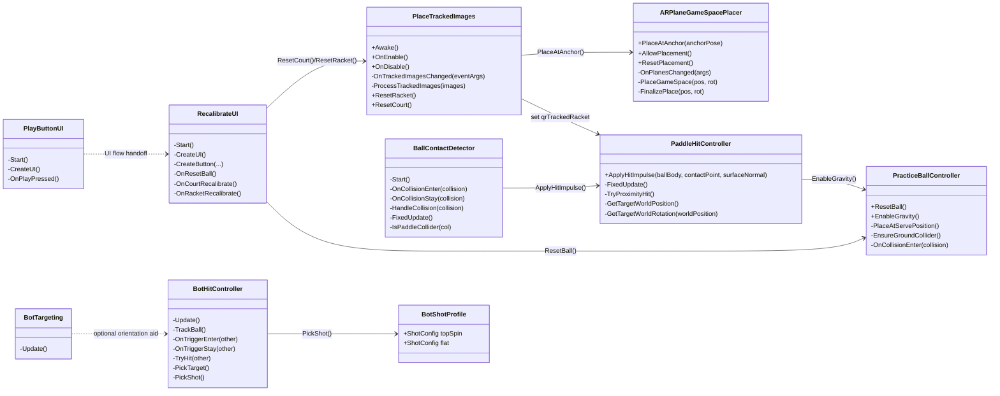
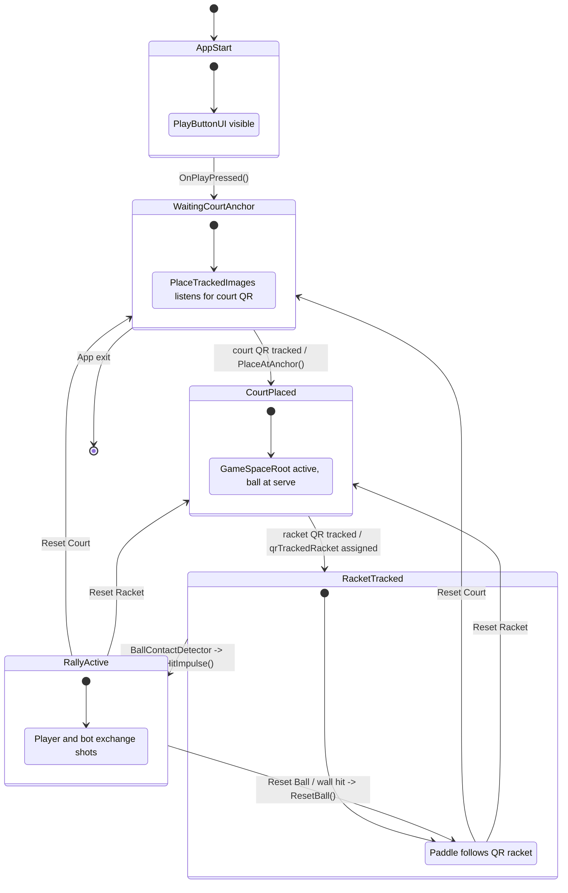

# Capstone AR Pickleball — Code Walkthrough

**Project:** AR Pickleball (Player vs. Bot)  
**Platform:** Android (AR Foundation / ARCore)  
**Engine:** Unity 2022+ (C#)  
**Date:** March 2026

---

## Table of Contents

- [Capstone AR Pickleball — Code Walkthrough](#capstone-ar-pickleball--code-walkthrough)
  - [Table of Contents](#table-of-contents)
  - [Used Scripts UML (Runtime Only)](#used-scripts-uml-runtime-only)
    - [Used Scripts Included](#used-scripts-included)
    - [UML Class Diagram (Scripts, Purpose, Key Functions)](#uml-class-diagram-scripts-purpose-key-functions)
    - [UML State Diagram (Application States)](#uml-state-diagram-application-states)
  - [1. Project Overview](#1-project-overview)
  - [2. Architecture Diagram](#2-architecture-diagram)
  - [3. Scene Hierarchy](#3-scene-hierarchy)
    - [GameSpaceRoot Children](#gamespaceroot-children)
  - [4. Script Inventory \& Relationships](#4-script-inventory--relationships)
    - [All Scripts (19 total)](#all-scripts-19-total)
    - [Dependency Graph (who calls whom)](#dependency-graph-who-calls-whom)
  - [5. Layer 1 — AR Placement \& Tracking](#5-layer-1--ar-placement--tracking)
    - [5.1 PlaceTrackedImages.cs](#51-placetrackedimagescs)
    - [5.2 ARPlaneGameSpacePlacer.cs](#52-arplanegamespaceplacercs)
  - [6. Layer 2 — Paddle (Player Input)](#6-layer-2--paddle-player-input)
    - [6.1 PaddleHitController.cs](#61-paddlehitcontrollercs)
    - [6.2 BallContactDetector.cs](#62-ballcontactdetectorcs)
  - [7. Layer 3 — Ball Physics \& Lifecycle](#7-layer-3--ball-physics--lifecycle)
    - [7.1 PracticeBallController.cs](#71-practiceballcontrollercs)
    - [7.2 BallAerodynamics.cs](#72-ballaerodynamicscs)
  - [8. Layer 4 — Bot AI](#8-layer-4--bot-ai)
    - [8.1 BotHitController.cs](#81-bothitcontrollercs)
    - [8.2 BotTargeting.cs](#82-bottargetingcs)
    - [8.3 BotShotProfile.cs](#83-botshotprofilecs)
  - [9. Layer 5 — UI](#9-layer-5--ui)
    - [9.1 PlayButtonUI.cs](#91-playbuttonuics)
    - [9.2 RecalibrateUI.cs](#92-recalibrateuics)
  - [10. Layer 6 — Utilities \& Diagnostics](#10-layer-6--utilities--diagnostics)
    - [10.1 ARHitDiagnostics.cs](#101-arhitdiagnosticscs)
    - [10.2 ARTrackedPaddleMapper.cs](#102-artrackedpaddlemappercs)
    - [10.3 ARPaddleCalibrationOverlay.cs](#103-arpaddlecalibrationoverlaycs)
    - [10.4 POVStartRotationReset.cs](#104-povstartrotationresetcs)
  - [11. Legacy Physics Scripts (Reference)](#11-legacy-physics-scripts-reference)
    - [Bot.cs (Legacy)](#botcs-legacy)
    - [Ball.cs (Legacy)](#ballcs-legacy)
    - [Player.cs (Legacy)](#playercs-legacy)
    - [ShotManager.cs (Legacy)](#shotmanagercs-legacy)
  - [12. Data Flow: What Happens When You Hit the Ball](#12-data-flow-what-happens-when-you-hit-the-ball)
  - [13. Key Design Decisions](#13-key-design-decisions)
    - [1. Two Paddle Objects (Physics vs. Visual)](#1-two-paddle-objects-physics-vs-visual)
    - [2. Gravity OFF Until Hit](#2-gravity-off-until-hit)
    - [3. Court-Local Coordinates](#3-court-local-coordinates)
    - [4. Three Layers of Hit Detection](#4-three-layers-of-hit-detection)
    - [5. COR-Based Impulse Model](#5-cor-based-impulse-model)
    - [6. Runtime UI Creation](#6-runtime-ui-creation)
  - [14. Known Limitations \& Future Work](#14-known-limitations--future-work)

---

## Used Scripts UML (Runtime Only)

This section includes **only scripts used by the active runtime flow** (attached and participating in gameplay/UI interactions). It excludes legacy and currently unmounted scripts.

### Used Scripts Included

- `PlaceTrackedImages.cs` — image tracking and prefab spawn/reset bridge
- `ARPlaneGameSpacePlacer.cs` — court/world placement and re-placement
- `PaddleHitController.cs` — paddle tracking and hit impulse solver
- `BallContactDetector.cs` — ball-side collision forwarding to paddle solver
- `PracticeBallController.cs` — ball spawn/reset/gravity lifecycle
- `BotHitController.cs` — bot tracking + return shots
- `BotShotProfile.cs` — bot shot parameter data
- `BotTargeting.cs` — optional bot auto-facing
- `PlayButtonUI.cs` — start overlay UI
- `RecalibrateUI.cs` — in-game reset/recalibration UI

Excluded as unused in normal runtime path:
- `BallAerodynamics.cs`, `ARTrackedPaddleMapper.cs`, `ARPaddleCalibrationOverlay.cs`
- `Assets/Physics/*` legacy scripts (`Bot.cs`, `Ball.cs`, `Player.cs`, `ShotManager.cs`)

### UML Class Diagram (Scripts, Purpose, Key Functions)



### UML State Diagram (Application States)



---

## 1. Project Overview

This project is an **augmented reality pickleball game** built with Unity AR Foundation. The player uses a **physical phone** as a racket (tracked via a QR code image marker) and plays against an **AI bot** on a virtual pickleball court anchored to the real world.

**Core gameplay loop:**
1. Player scans a **court QR code** → virtual court is placed on the floor.
2. Player scans a **racket QR code** → the phone becomes the racket.
3. A pickleball hovers at the serve position on the court.
4. Player swings their phone through the ball → physics impulse launches it.
5. The bot tracks the ball and returns it.
6. Play continues rally-style.

**Technology stack:**
| Component | Technology |
|-----------|-----------|
| AR Runtime | AR Foundation 5.x + ARCore (Android) |
| Image Tracking | `ARTrackedImageManager` + Reference Image Library |
| Plane Detection | `ARPlaneManager` (used for floor Y) |
| Physics | Unity PhysX (Rigidbody, Colliders, impulse model) |
| UI | Unity UI (Canvas, uGUI), created via code at runtime |

---

## 2. Architecture Diagram

```
┌──────────────────── DEVICE CAMERA ────────────────────┐
│                                                        │
│  ARTrackedImageManager ─── PlaceTrackedImages.cs       │
│       │                      │            │            │
│       │ court QR detected    │ racket QR  │            │
│       ▼                      ▼ detected   │            │
│  ARPlaneGameSpacePlacer     Spawns prefab  │           │
│       │                      │             │           │
│       │ PlaceAtAnchor()      │ Wires to    │           │
│       ▼                      ▼             │           │
│  GameSpaceRoot (ARAnchor)   PaddleHit-     │           │
│    ├── Court mesh            Controller    │           │
│    ├── Lamps                 .qrTracked    │           │
│    ├── Ball2 ◄──────────────Racket         │           │
│    │   ├ Rigidbody                         │           │
│    │   ├ BallContactDetector ──► PaddleHitController   │
│    │   ├ PracticeBallController            │           │
│    │   └ SphereCollider                    │           │
│    ├── Bot                                 │           │
│    │   ├ BotHitController                  │           │
│    │   ├ BotShotProfile                    │           │
│    │   └ BotTargeting                      │           │
│    └── BotAimTarget                        │           │
│        ├ Target1                           │           │
│        ├ Target2                           │           │
│        └ Target3                           │           │
│                                                        │
│  PlayerPaddle (scene root)                             │
│    ├ Rigidbody (kinematic)                             │
│    ├ BoxCollider                                       │
│    └ PaddleHitController ◄── drives physics collisions │
│                                                        │
│  GameFlowManager                                       │
│    ├ PlayButtonUI.cs                                   │
│    └ RecalibrateUI.cs                                  │
│                                                        │
│  XR Origin (AR Rig)                                    │
│    ├ ARPlaneGameSpacePlacer.cs                         │
│    ├ PlaceTrackedImages.cs                             │
│    ├ ARTrackedImageManager                             │
│    ├ ARPlaneManager                                    │
│    ├ ARAnchorManager                                   │
│    └ Camera (AR)                                       │
└────────────────────────────────────────────────────────┘
```

---

## 3. Scene Hierarchy

The main scene (`MainScene.unity`) contains these top-level GameObjects:

| GameObject | Purpose | Key Components |
|-----------|---------|---------------|
| **XR Origin (AR Rig)** | AR session root | `ARPlaneManager`, `ARRaycastManager`, `ARTrackedImageManager`, `ARAnchorManager`, `ARPlaneGameSpacePlacer`, `PlaceTrackedImages` |
| **AR Camera** | Phone camera | Under XR Origin; provides `Camera.main` |
| **GameSpaceRoot** | Virtual court world | Contains court mesh, lamps, ball, bot, targets. Hidden until court QR is scanned. |
| **PlayerPaddle** | Physics paddle | `Rigidbody` (kinematic), `BoxCollider`, `PaddleHitController` |
| **GameFlowManager** | Game logic hub | `PlayButtonUI`, `RecalibrateUI`, `ARHitDiagnostics` |
| **Directional Light** | Scene lighting | Standard Unity light |

### GameSpaceRoot Children

| Child | Description |
|-------|------------|
| `pickleball court (4)` | Court mesh with `MeshCollider` + bounce physics material |
| `court_screen` | Visual court boundary lines |
| `Lamps` | Decorative court lighting |
| `bot` | AI opponent — has `BotHitController`, `BotShotProfile`, `BotTargeting`, `Animator` |
| `Ball2` | The pickleball — has `Rigidbody`, `SphereCollider`, `PracticeBallController`, `BallContactDetector`, `TrailRenderer` |
| `BotAimTarget` | Parent for Target1, Target2, Target3 (where the bot aims) |
| `racquet` | Bot's visual racket mesh |
| `walls` | Court boundary walls (tagged "Wall") |

---

## 4. Script Inventory & Relationships

### All Scripts (19 total)

| # | Script | Location | Attached To | Lines |
|---|--------|----------|-------------|-------|
| 1 | `PlaceTrackedImages.cs` | Assets/ | XR Origin | ~170 |
| 2 | `ARPlaneGameSpacePlacer.cs` | Assets/Scripts/ | XR Origin | ~482 |
| 3 | `PaddleHitController.cs` | Assets/Scripts/ | PlayerPaddle | ~537 |
| 4 | `BallContactDetector.cs` | Assets/Scripts/ | Ball2 | ~214 |
| 5 | `PracticeBallController.cs` | Assets/Scripts/ | Ball2 | ~140 |
| 6 | `BallAerodynamics.cs` | Assets/Scripts/ | *(not attached in scene)* | ~85 |
| 7 | `BotHitController.cs` | Assets/Scripts/ | bot | ~173 |
| 8 | `BotTargeting.cs` | Assets/Scripts/ | bot | ~33 |
| 9 | `BotShotProfile.cs` | Assets/Scripts/ | bot | ~17 |
| 10 | `PlayButtonUI.cs` | Assets/Scripts/ | GameFlowManager | ~118 |
| 11 | `RecalibrateUI.cs` | Assets/Scripts/ | GameFlowManager | ~163 |
| 12 | `ARHitDiagnostics.cs` | Assets/Scripts/ | GameFlowManager | ~415 |
| 13 | `ARTrackedPaddleMapper.cs` | Assets/Scripts/ | *(not attached in scene)* | ~305 |
| 14 | `ARPaddleCalibrationOverlay.cs` | Assets/Scripts/ | *(not attached in scene)* | ~177 |
| 15 | `POVStartRotationReset.cs` | Assets/Scripts/ | AR Camera | ~24 |
| 16 | `Bot.cs` | Assets/Physics/ | *(legacy, not used)* | ~70 |
| 17 | `Ball.cs` | Assets/Physics/ | *(legacy, not used)* | ~22 |
| 18 | `Player.cs` | Assets/Physics/ | *(legacy, not used)* | ~96 |
| 19 | `ShotManager.cs` | Assets/Physics/ | *(legacy, not used)* | ~17 |

### Dependency Graph (who calls whom)

```
PlaceTrackedImages
    ├──► ARPlaneGameSpacePlacer.PlaceAtAnchor()     [court QR detected]
    └──► PaddleHitController.qrTrackedRacket = ...  [racket QR detected]

BallContactDetector (on Ball2)
    └──► PaddleHitController.ApplyHitImpulse()      [collision/overlap detected]

PaddleHitController.ApplyHitImpulse()
    ├──► Rigidbody.AddForce()                        [impulse on ball]
    └──► PracticeBallController.EnableGravity()      [turn on gravity after first hit]

RecalibrateUI
    ├──► PracticeBallController.ResetBall()           [Reset Ball button]
    ├──► PlaceTrackedImages.ResetCourt()              [↻ Court button]
    └──► PlaceTrackedImages.ResetRacket()             [↻ Racket button]

BotHitController
    └──► Rigidbody.velocity = ...                    [bot returns ball via OnTriggerEnter]
```

---

## 5. Layer 1 — AR Placement & Tracking

### 5.1 PlaceTrackedImages.cs

**Location:** `Assets/PlaceTrackedImages.cs`  
**Attached to:** XR Origin (AR Rig)  
**Purpose:** Listens for AR image tracking events and spawns corresponding prefabs (racket) or triggers court placement.

**How it works:**
1. Caches a reference to `ARTrackedImageManager` in `Awake()`.
2. Subscribes to `trackedImagesChanged` event in `OnEnable()`.
3. When images are added or updated:
   - If the image name matches `courtAnchorImageName` ("court_anchor") → calls `ARPlaneGameSpacePlacer.PlaceAtAnchor(pose)`.
   - For all other images → iterates through `ArPrefabs[]` array, finds a prefab whose name matches the image name, and spawns it as a child of the tracked image transform.
   - After spawning a racket prefab → finds `PaddleHitController` in scene and sets `paddle.qrTrackedRacket = newPrefab.transform`.
4. Prefab visibility is toggled based on `TrackingState.Tracking`.

**Public API:**
| Method | Called by | What it does |
|--------|----------|-------------|
| `ResetRacket()` | RecalibrateUI | Destroys spawned prefabs, nulls `qrTrackedRacket`, so next QR scan re-spawns |
| `ResetCourt()` | RecalibrateUI | Resets `_courtPlaced` flag, calls `gamePlacer.ResetPlacement()` |

**Key variables:**
```csharp
public GameObject[] ArPrefabs;           // Prefabs to spawn (matched by name)
public ARPlaneGameSpacePlacer gamePlacer; // Auto-resolved if null
public string courtAnchorImageName;      // "court_anchor" — name in Reference Image Library
```

---

### 5.2 ARPlaneGameSpacePlacer.cs

**Location:** `Assets/Scripts/ARPlaneGameSpacePlacer.cs`  
**Attached to:** XR Origin (AR Rig)  
**Purpose:** Positions the `GameSpaceRoot` in AR space using a combination of QR anchor position and detected plane height.

**How it works:**

1. **Awake:** Resolves AR managers, ensures an `ARAnchorManager` exists, hides `GameSpaceRoot` if configured.
2. **Plane detection:** Subscribes to `ARPlaneManager.planesChanged`. Stores the Y-coordinate of the first detected horizontal plane as `_floorY`.
3. **PlaceAtAnchor(Pose)** — the main placement method:
   - Uses the QR anchor's X/Z position for horizontal alignment.
   - Forces Y to `_floorY` (detected floor plane) so the court sits on the ground.
   - Extracts only the yaw component from the QR rotation (no pitch/roll).
   - Creates an `ARAnchor` (plane-attached if possible, otherwise free-floating).
   - Parents `GameSpaceRoot` under the anchor at local origin.
   - Activates `GameSpaceRoot`, disables plane visuals and detection.

**Why anchor-based?** The `ARAnchor` prevents coordinate drift. As ARCore refines its world map, the anchor stays fixed to the physical location.

**Public API:**
| Method | Called by | What it does |
|--------|----------|-------------|
| `PlaceAtAnchor(Pose)` | PlaceTrackedImages | Places court using QR X/Z + plane Y |
| `AllowPlacement()` | *(external trigger)* | Deferred placement when `waitForExternalTrigger=true` |
| `ResetPlacement()` | PlaceTrackedImages.ResetCourt() | Destroys anchor, hides court, re-enables plane detection |

---

## 6. Layer 2 — Paddle (Player Input)

### 6.1 PaddleHitController.cs

**Location:** `Assets/Scripts/PaddleHitController.cs`  
**Attached to:** PlayerPaddle (scene root-level object)  
**Purpose:** The core physics engine for the player's racket. Positions the kinematic paddle, computes finite-difference velocity, and applies physically-based impulses when the ball is hit.

**Dual tracking modes (FixedUpdate):**

| Mode | Condition | Behavior |
|------|-----------|----------|
| **QR Mode** | `qrTrackedRacket != null` and active | Teleports paddle to QR-tracked racket position every physics tick |
| **Camera Mode** | Fallback | Places paddle at a screen point relative to the AR camera (editor testing or no QR) |

**Velocity computation:**
The paddle is kinematic, so `Rigidbody.velocity` is always zero. Instead, the script computes velocity via **finite-difference**:
```
paddleVelocity = (currentPosition - previousPosition) / fixedDeltaTime
```
Angular velocity is similarly derived from the quaternion delta between frames.

**Hit impulse physics (`ApplyHitImpulse`):**

This is the heart of the game. It models a real pickleball paddle-ball collision:

1. **Surface normal sanitization** — ensures normal points from paddle toward ball.
2. **Paddle surface velocity** — includes rotational contribution (wrist snap):
   ```
   v_surface = v_paddle + ω_paddle × (contactPoint − paddleCOM)
   ```
3. **Relative velocity** — ball velocity minus paddle surface velocity.
4. **Normal impulse (COR model):**
   ```
   Δv_n = −(1 + e) · vN · n̂
   ```
   Where e = coefficient of restitution (0.86, realistic for pickleball).
5. **Tangential impulse (Coulomb friction):**
   ```
   |Δv_t| ≤ μ · |Δv_n|
   ```
   This creates spin and directional control.
6. **Speed cap** — clamps to `maxBallSpeed` (22 m/s).
7. **Gravity enable** — after the first hit, turns on `ballBody.useGravity = true` and calls `PracticeBallController.EnableGravity()`.
8. **Angular impulse (spin):**
   - Off-center contact → `spinFromOffCenter * Cross(r, Δv_t)`
   - Paddle rotation → `spinFromTangential * Cross(n̂, ω_paddle)`

**Collision detection paths (3 redundant layers):**

| Path | Source | Reliability |
|------|--------|-------------|
| `BallContactDetector.OnCollisionEnter` | Primary | Most reliable (dynamic body callback) |
| `PaddleHitController.OnCollisionEnter` | Secondary | Kinematic body callback (less reliable) |
| `TryProximityHit()` | Fallback | OverlapSphere proximity check every FixedUpdate |

**Key Inspector parameters:**
```csharp
restitution = 0.86f;           // Coefficient of restitution
frictionCoefficient = 0.35f;   // Surface friction
maxBallSpeed = 22f;            // Speed cap (m/s)
proximityHitDistance = 0.12f;  // Fallback detection radius
hitCooldown = 0.03f;           // Minimum time between hits
```

---

### 6.2 BallContactDetector.cs

**Location:** `Assets/Scripts/BallContactDetector.cs`  
**Attached to:** Ball2  
**Purpose:** Sits on the ball (dynamic Rigidbody) to reliably receive collision callbacks when the kinematic paddle moves into it. Forwards hits to `PaddleHitController.ApplyHitImpulse()`.

**Why on the ball?** Unity fires `OnCollisionEnter` on the **dynamic** body when a kinematic body moves into it. The kinematic body (paddle) does NOT reliably receive collision callbacks. This is a fundamental Unity physics behavior.

**How it works:**
1. **Start:** Auto-finds `PaddleHitController` via `FindFirstObjectByType`, caches all paddle colliders.
2. **OnCollisionEnter / OnCollisionStay:** Checks if the collision collider belongs to the paddle. If yes, extracts `ContactPoint` data and calls `paddle.ApplyHitImpulse(ballRigidbody, contactPoint, contactNormal)`.
3. **FixedUpdate (OverlapSphere fallback):** Runs `Physics.OverlapSphere` centered on the ball. If any paddle collider is within `overlapRadius` (0.10m), computes contact point and normal, then calls `ApplyHitImpulse`. This catches edge cases where Unity misses the collision callback due to tunneling.

**Key parameter:**
```csharp
public float overlapRadius = 0.10f;  // OverlapSphere radius for fallback detection
```

---

## 7. Layer 3 — Ball Physics & Lifecycle

### 7.1 PracticeBallController.cs

**Location:** `Assets/Scripts/PracticeBallController.cs`  
**Attached to:** Ball2  
**Purpose:** Manages the ball's lifecycle — spawning position, gravity state, reset logic, and ground safety.

**Critical design: Gravity OFF until hit**  
The ball starts with `useGravity = false`. This prevents it from falling through the court before the player swings. Only after `PaddleHitController.ApplyHitImpulse()` fires does gravity get enabled via `EnableGravity()`.

**Serve positioning:**
```csharp
public Vector3 courtServeLocalPos = new Vector3(0.44f, 0.25f, 2.0f);
```
The ball spawns at this position **relative to GameSpaceRoot**. If an external `servePoint` Transform is assigned, it uses that instead (camera-relative).

**Ground safety:**
The court mesh has a non-convex MeshCollider that may have gaps. To prevent the ball from falling through:
```csharp
EnsureGroundCollider();  // Creates "_CourtFloor" — a thin 14m × 16m BoxCollider at Y ≈ 0
```

**Public API:**
| Method | Called by | What it does |
|--------|----------|-------------|
| `ResetBall()` | RecalibrateUI, keyboard (R key) | Zeros velocity, disables gravity, re-places at serve position |
| `EnableGravity()` | PaddleHitController | Sets `useGravity = true` after first hit |

**Wall reset:**
```csharp
void OnCollisionEnter(Collision collision) {
    if (collision.transform.CompareTag("Wall")) ResetBall();
}
```

---

### 7.2 BallAerodynamics.cs

**Location:** `Assets/Scripts/BallAerodynamics.cs`  
**Attached to:** *(Not attached in current scene — available for future use)*  
**Purpose:** Applies realistic aerodynamic forces to the pickleball.

**Physics model:**
1. **Quadratic drag:**
   ```
   F_drag = −velocity × (dragCoefficient × speed)
   ```
   Derived from real wind-tunnel data: Cd = 0.40 for a holey pickleball.

2. **Magnus lift (spin-induced curve):**
   ```
   F_magnus = Cross(angularVelocity, velocity) × magnusCoefficient
   ```
   Topspin dips the ball, backspin makes it float, sidespin curves it.

**Key parameters (real-world derived):**
```csharp
dragCoefficient = 0.040f;     // From Cd=0.40, ρ=1.225, A=0.0043m², m=0.0265kg
magnusCoefficient = 0.00075f; // From Cl=0.20
maxAngularSpeed = 80f;        // ~764 RPM (competitive topspin)
```

> **Note:** This script is not currently attached to Ball2 in the scene. Attaching it would add drag and spin physics for more realistic ball flight.

---

## 8. Layer 4 — Bot AI

### 8.1 BotHitController.cs

**Location:** `Assets/Scripts/BotHitController.cs`  
**Attached to:** bot (inside GameSpaceRoot)  
**Purpose:** Replaces the legacy `Physics/Bot.cs` for the AR environment. Drives the bot's lateral movement and ball-hitting behavior using local-space coordinates.

**How it works:**
1. **TrackBall() (Update):** Moves the bot laterally (X axis in local space) to stay aligned with the ball. Uses `transform.parent.InverseTransformPoint(ball.position)` so it works correctly regardless of GameSpaceRoot's world position/rotation.
2. **OnTriggerEnter/Stay:** When the ball enters the bot's trigger collider:
   - Picks a random shot from `BotShotProfile` (topspin or flat).
   - Picks a random target from the targets array (left/center/right on the player's side).
   - Applies velocity: `dir.normalized * hitForce + up * upForce`.
   - Plays forehand or backhand animation based on ball direction.

**Key parameters:**
```csharp
public float moveSpeed = 2f;       // Lateral tracking speed
public float hitCooldown = 0.25f;  // Min time between hits
public float zTrackRange = 0.3f;   // Forward/back tracking range
```

---

### 8.2 BotTargeting.cs

**Location:** `Assets/Scripts/BotTargeting.cs`  
**Attached to:** bot  
**Purpose:** Optional auto-aim — rotates the bot to face the ball.

**How it works:**
If `autoAimAtBall` is true, the bot smoothly rotates (yaw only, `y=0`) to face the ball using `Quaternion.Slerp` with `turnSpeed`.

---

### 8.3 BotShotProfile.cs

**Location:** `Assets/Scripts/BotShotProfile.cs`  
**Attached to:** bot  
**Purpose:** Data container holding the bot's shot configurations.

```csharp
[Serializable]
public struct ShotConfig {
    public float upForce;    // Upward component of ball velocity
    public float hitForce;   // Forward component of ball velocity
}

public ShotConfig topSpin;   // Set in Inspector (e.g., upForce=6, hitForce=12)
public ShotConfig flat;      // Set in Inspector (e.g., upForce=3, hitForce=16)
```

---

## 9. Layer 5 — UI

### 9.1 PlayButtonUI.cs

**Location:** `Assets/Scripts/PlayButtonUI.cs`  
**Attached to:** GameFlowManager  
**Purpose:** Full-screen "TAP TO PLAY" overlay shown at game start.

**How it works:**
1. Creates a `ScreenSpaceOverlay` canvas at `sortingOrder=999` (on top of everything).
2. Semi-transparent black background covers the entire screen and acts as a button (tapping anywhere dismisses).
3. Instruction text: "Point your camera at the Court QR code to place the court, then tap Play."
4. Green "TAP TO PLAY" button in the center.
5. `OnPlayPressed()` → destroys the canvas and the component itself.

---

### 9.2 RecalibrateUI.cs

**Location:** `Assets/Scripts/RecalibrateUI.cs`  
**Attached to:** GameFlowManager  
**Purpose:** In-game touch HUD with three buttons.

**Layout (portrait phone):**
```
┌──────────────────────────────────────┐
│                         [↻ Racket]   │  ← top-right row 1
│                         [↻ Court ]   │  ← top-right row 2
│                                      │
│                                      │
│                          [Reset Ball] │  ← bottom-right (large, blue)
└──────────────────────────────────────┘
```

**Buttons:**
| Button | Anchor | Color | Action |
|--------|--------|-------|--------|
| **Reset Ball** | bottom-right (62%–98% X, 2%–9% Y) | Blue accent | `PracticeBallController.ResetBall()` |
| **↻ Racket** | top-right row 1 (72%–98% X, 92%–98% Y) | Dark gray | `PlaceTrackedImages.ResetRacket()` |
| **↻ Court** | top-right row 2 (72%–98% X, 85%–91% Y) | Dark gray | `PlaceTrackedImages.ResetCourt()` |

All UI is created via code at runtime (no prefab dependencies). The canvas uses `ScaleWithScreenSize` at reference resolution 1080×1920.

---

## 10. Layer 6 — Utilities & Diagnostics

### 10.1 ARHitDiagnostics.cs

**Location:** `Assets/Scripts/ARHitDiagnostics.cs`  
**Attached to:** GameFlowManager  
**Purpose:** Runtime diagnostic tool that visualizes the relationship between the physics paddle, QR racket, and ball.

**Features:**
- **Auto-discovery:** Periodically scans the scene for `PaddleHitController`, `BallContactDetector`, and the QR-spawned racket.
- **On-screen HUD:** Semi-transparent overlay in the bottom-left showing world positions, distances, and hit count.
- **Console logging:** Every 1 second (filterable by `[DIAG]`), logs all object positions and distances.
- **Hit detection:** Monitors ball velocity changes in `FixedUpdate`. A ΔV > 1 m/s registers as a hit.
- **Auto-fixes:**
  - Paddle BoxCollider 1m³ → 0.22×0.26×0.02m (realistic paddle size).
  - Ball collision mode Discrete → ContinuousDynamic (prevents tunneling).
  - Paddle collision mode Discrete → ContinuousSpeculative.
- **Warnings:** Alerts if physics paddle is far from QR racket, or if ball is near paddle but no hit occurred.

---

### 10.2 ARTrackedPaddleMapper.cs

**Location:** `Assets/Scripts/ARTrackedPaddleMapper.cs`  
**Status:** Not attached to any scene object (available for advanced calibration)  
**Purpose:** Maps QR tracked image pose to a paddle pivot with position/rotation offsets. Supports keyboard-based calibration (WASD/QE for position, IKJLUO for rotation) and saves offsets to `PlayerPrefs`.

---

### 10.3 ARPaddleCalibrationOverlay.cs

**Location:** `Assets/Scripts/ARPaddleCalibrationOverlay.cs`  
**Status:** Not attached to any scene object (available for advanced calibration)  
**Purpose:** An `OnGUI` window that provides visual paddle calibration controls. Finds an `ARTrackedPaddleMapper` and exposes position/rotation adjustment buttons.

---

### 10.4 POVStartRotationReset.cs

**Location:** `Assets/Scripts/POVStartRotationReset.cs`  
**Attached to:** AR Camera  
**Purpose:** Resets the camera's local rotation to identity on `Start()`. Optionally locks roll and pitch in `LateUpdate()` (keeping only yaw) for a stabilized view.

---

## 11. Legacy Physics Scripts (Reference)

These scripts are in `Assets/Physics/` and represent the **original non-AR game prototype**. They are **not used** in the AR version but serve as design reference.

### Bot.cs (Legacy)
- Moves bot X-position to track ball at speed 40.
- On `OnTriggerEnter("Ball")`: picks random target, picks random shot (topspin/flat), sets `Rigidbody.velocity`.
- Plays forehand/backhand animation.
- **AR replacement:** `BotHitController.cs` (uses local-space coordinates, lower speeds).

### Ball.cs (Legacy)
- Stores `initialPos` at `Start()`.
- On `OnCollisionEnter("Wall")`: resets velocity to zero, teleports to `initialPos`.
- **AR replacement:** `PracticeBallController.cs` (gravity management, court-local spawn, floor safety).

### Player.cs (Legacy)
- Keyboard-controlled player (WASD movement, F = topspin, E = flat).
- Moves an aim target, then on `OnTriggerEnter("Ball")` applies directional force.
- **AR replacement:** `PaddleHitController.cs` (phone-as-racket via QR tracking, COR physics model).

### ShotManager.cs (Legacy)
- Simple data container: `Shot` class with `upForce` and `hitForce`.
- Two instances: `topSpin` and `flat`.
- **AR replacement:** `BotShotProfile.cs` (struct-based, same concept).

---

## 12. Data Flow: What Happens When You Hit the Ball

This is the complete chain of events from phone swing to ball flight:

```
Step 1: QR TRACKING
───────────────────
ARTrackedImageManager detects racket QR → updates ARTrackedImage pose
    └──► PlaceTrackedImages spawns Racket_Pickleball4 prefab
         └──► Sets PaddleHitController.qrTrackedRacket = spawned transform

Step 2: PADDLE POSITIONING (every FixedUpdate, 50 Hz)
────────────────────────────────────────────────────
PaddleHitController.FixedUpdate():
    qrTrackedRacket is set → QR Mode
    │
    ├── Read qrTrackedRacket.position/rotation
    ├── Compute paddleVelocity = (pos - prevPos) / dt
    ├── Compute paddleAngularVelocity from quaternion delta
    ├── MovePosition(qrPos) + MoveRotation(qrRot) on kinematic Rigidbody
    └── TryProximityHit() — OverlapSphere fallback check

Step 3: COLLISION DETECTION
──────────────────────────
OPTION A (Primary): Unity PhysX detects paddle BoxCollider overlapping ball SphereCollider
    └──► BallContactDetector.OnCollisionEnter(collision)
         ├── IsPaddleCollider(collision.collider) → true
         └── paddle.ApplyHitImpulse(ballRb, contact.point, contact.normal)

OPTION B (Fallback): PaddleHitController.TryProximityHit()
    └──► OverlapSphere finds ball within 0.12m
         └── paddle.ApplyHitImpulse(...)

Step 4: IMPULSE COMPUTATION
──────────────────────────
PaddleHitController.ApplyHitImpulse(ballBody, contactPoint, surfaceNormal):
    │
    ├── Sanitize surface normal → must point paddle→ball
    ├── Compute paddle surface velocity at contact point:
    │     v_surface = v_paddle + ω_paddle × (contactPoint - paddleCOM)
    ├── Compute relative velocity: v_rel = v_ball - v_surface
    ├── Normal component: vN = dot(v_rel, normal)
    │     Guard: only fire if vN < 0.05 (paddle moving INTO ball)
    │
    ├── Normal impulse:  Δv_n = -(1 + 0.86) × vN × normal
    ├── Tangential impulse:  Δv_t = -friction × tangentialRelVel (clamped to Coulomb cone)
    ├── New velocity = ball.velocity + Δv_n + Δv_t (clamped to 22 m/s)
    │
    ├── ballBody.AddForce(newVelocity - ballBody.velocity, VelocityChange)
    ├── ballBody.useGravity = true  ← GRAVITY ON!
    ├── PracticeBallController.EnableGravity()
    │
    └── Angular impulse:
          spin = spinFromOffCenter × Cross(offset, Δv_t)
                + spinFromTangential × Cross(normal, ω_paddle)
          ballBody.AddTorque(spin, VelocityChange)

Step 5: BALL FLIGHT
──────────────────
Ball Rigidbody with gravity ON follows parabolic arc
    └── (Optional) BallAerodynamics.FixedUpdate() applies drag + Magnus (if attached)

Step 6: BOT RESPONSE
────────────────────
BotHitController.Update():
    └── TrackBall() — laterally follows ball in local space

BotHitController.OnTriggerEnter(ball):
    ├── PickShot() → random topspin or flat from BotShotProfile
    ├── PickTarget() → random Target1/2/3 on player's side
    ├── ballRb.velocity = dir.normalized × hitForce + up × upForce
    └── animator.Play("forehand" or "backhand")

Step 7: BALL RESET
─────────────────
Ball hits wall tagged "Wall" → PracticeBallController.OnCollisionEnter()
    └── ResetBall() → zeros velocity, gravity OFF, re-place at serve position

OR: Player presses "Reset Ball" button → RecalibrateUI.OnResetBall()
    └── PracticeBallController.ResetBall()
```

---

## 13. Key Design Decisions

### 1. Two Paddle Objects (Physics vs. Visual)
| Object | Role | Has Collider? | Has Rigidbody? |
|--------|------|:------------:|:--------------:|
| **PlayerPaddle** | Physics collision body | ✅ BoxCollider | ✅ Kinematic |
| **Racket_Pickleball4** (QR-spawned) | Visual representation | ❌ | ❌ |

The QR-spawned racket is the visual marker the player sees. The PlayerPaddle is an invisible physics proxy that teleports to the QR racket's position every `FixedUpdate`. This separation exists because:
- The QR-spawned prefab may not have proper colliders.
- Physics requires a kinematic Rigidbody with specific settings.
- The teleporting proxy ensures consistent collision behavior.

### 2. Gravity OFF Until Hit
The ball spawns with `useGravity = false`. Without this, the ball falls through the court immediately after GameSpaceRoot is activated (before the player has a chance to swing). Gravity is enabled in `ApplyHitImpulse()` after the first real hit.

### 3. Court-Local Coordinates
All gameplay objects (ball serve position, bot movement) use **local-space coordinates relative to GameSpaceRoot**. This means the entire court can be placed at any world position/rotation by the AR system, and all gameplay logic still works correctly.

### 4. Three Layers of Hit Detection
Physics collision detection in AR is unreliable due to frame rate variations and fast racket movement. Three redundant layers ensure the player feels a responsive hit:
1. `BallContactDetector.OnCollisionEnter` (Unity's native callback)
2. `PaddleHitController.OnCollisionEnter` (secondary kinematic-side callback)
3. `TryProximityHit()` (OverlapSphere proximity check)

### 5. COR-Based Impulse Model
Rather than a simple "add force in forward direction," the paddle uses a real coefficient-of-restitution model with Coulomb friction. This means:
- Hitting the ball head-on produces a powerful drive.
- Angling the paddle creates slice/spin.
- Wrist rotation contributes to spin.
- The ball deflects naturally based on paddle orientation.

### 6. Runtime UI Creation
All UI (PlayButtonUI, RecalibrateUI) is created via code in `Start()`/`CreateUI()` rather than using pre-built prefabs. This avoids prefab/scene merge conflicts and guarantees the UI exists regardless of scene setup.

---

## 14. Known Limitations & Future Work

| Item | Status | Notes |
|------|--------|-------|
| `BallAerodynamics.cs` not attached to Ball2 | Available | Would add realistic drag and spin-curve to ball flight |
| `ARTrackedPaddleMapper.cs` not in use | Available | Would add position/rotation calibration offsets to QR racket |
| Ball2 tag is "Untagged" | Minor | Should be set to "Ball" for cleaner detection |
| PlayerPaddle BoxCollider starts at 1m³ | Auto-fixed at runtime | `ARHitDiagnostics` shrinks it to 0.22×0.26×0.02m |
| No scoring system | Future | Track points, serve alternation, match rules |
| No sound effects | Future | Hit sounds, bounce sounds, crowd ambiance |
| Single-player only | By design | Player vs. bot; multiplayer would require networking |
| Court QR must be scanned first | By design | Plane Y is needed before court placement |

---

*Document generated for capstone code walkthrough presentation.*
